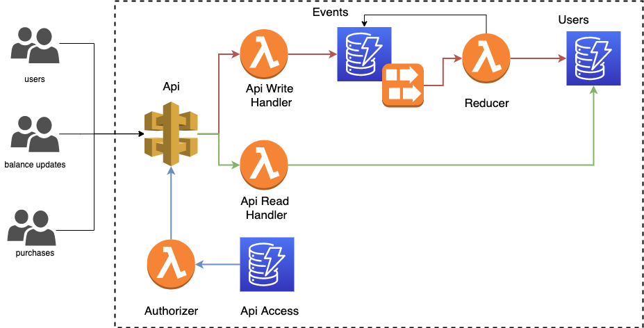

# CDK Serverless Application

Serverless Application receiving User information from various sources and combine them into one current state.

[Data structures](./docs/data.md) in application used in application.

## Useful commands

- `yarn build` compile typescript to js
- `yarn watch` watch for changes and compile
- `yarn test` perform the jest unit tests
- `yarn fix` apply linting and formatting
- `yarn format` check linting and formatting rules

- `cdk deploy` deploy this stack to your default AWS account/region
- `cdk diff` compare deployed stack with current state
- `cdk synth` emits the synthesized CloudFormation template

## Scripts

Within `./scripts` folder:

- `build.sh` build CDK application, test it and check formatting
- `clean.sh` remove all `.js` transpiled files
- `deploy.sh` deploy CDK application
